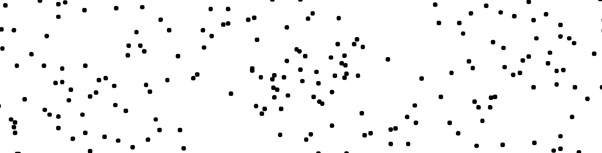
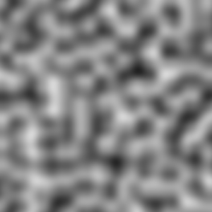
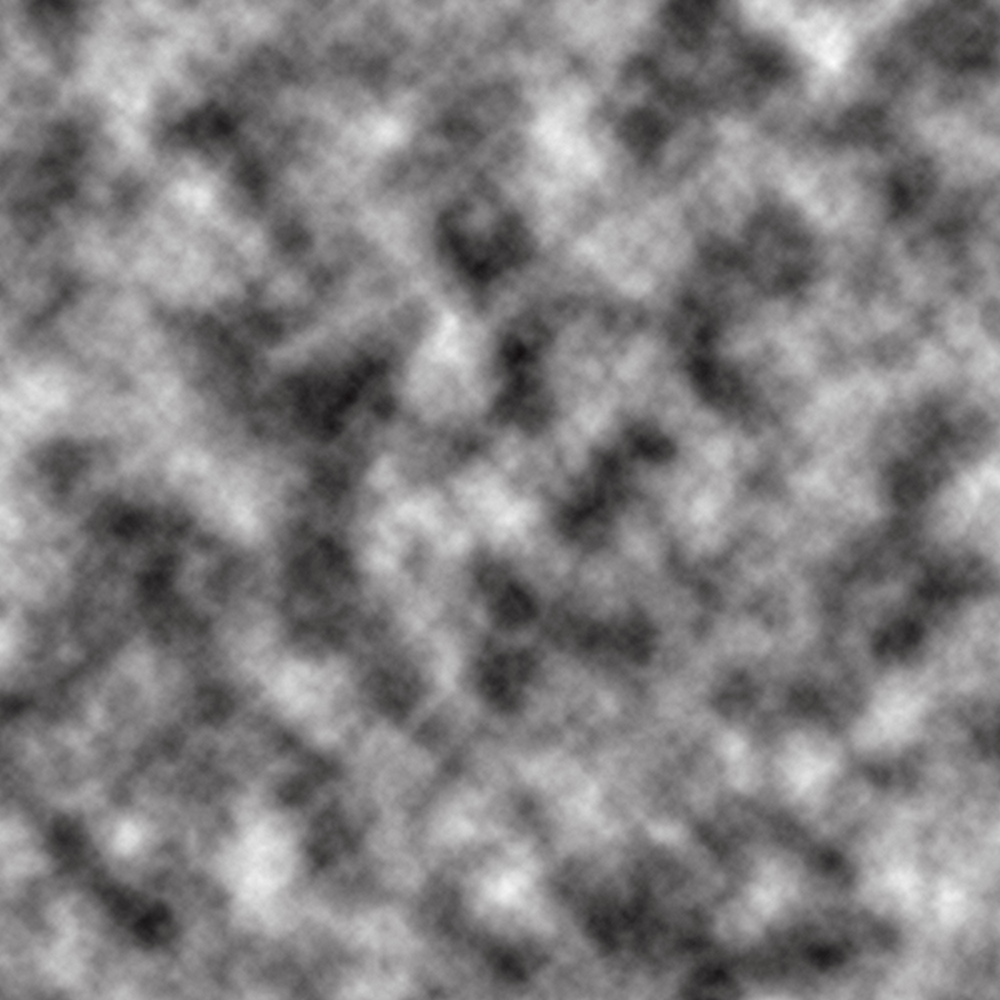
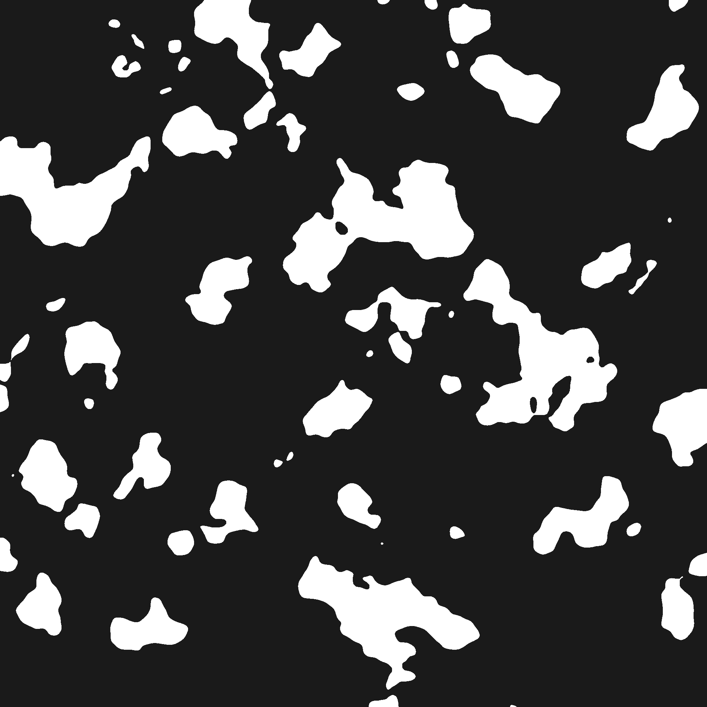
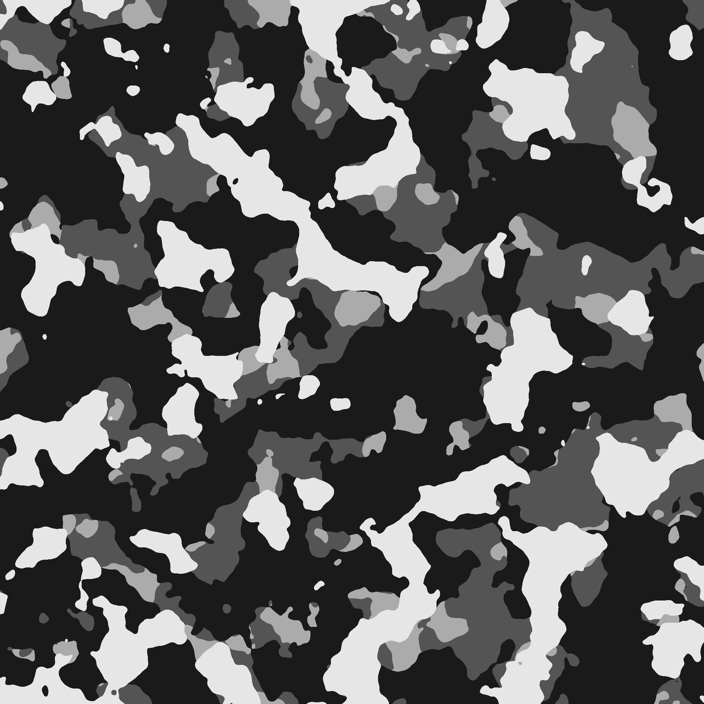

layout: true

background-image: url(resources/camo-8000px-transparent.png)
background-size: 2000px, 2000px

---

background-color: #111111
class: center, middle, white-text

# Procedural Generation in C++ vs. Photoshop:
## Learn, Benchmark, and Prove Nothing

06/12/2018

Meven 'mevouc' Courouble

???

Bonsoir,

Je suis ...

Ce soir = parler d'un projet perso + raconter une histoire, expérience

Pour certains : se souvenir d'expériences similaires

Pour d'autres : des tips pour jour avec ce qui nous plait (projets perso)

---

# Idea

### What I wanted

- Learn Ruby

- Play with a new image processing library

- Do a side-project with procedural generation

???

Au début :
- Je kiffe la manipulation d'image
- Déjà des projets perso image
- Déjà un projet en C++
- Apprendre le Ruby : langage de script, connais pas beaucoup
- Manipuler nouvelle bibliothèque image
- Entendu parler de génération procédurale, envie d'apprendre

--

### What I actually did

- C++ project with OpenCV library (for the second time)

- Learned procedural generation

- Lost my time

- Did another version using Photoshop

???

En pratique :
- Ai créé le repo en juillet 2017
- Pas touché pendant 1 an et 4 mois
- Repris le truc y a un mois
- Plus le temps de prendre un nouveau langage
- Voulu me concentrer sur le projet en lui-même et apprendre bruit de Perlin et
  génération procédurale
- Utilisé C++ et OpenCV, déjà bonne maîtrise

Après plusieurs heures, découvert que faisable avec Photoshop -> Idée de le
faire pour voir

Découverte = Photoshop c'était super plus simple

Plan :
1. Le projet, présentation du cœur de la partie procédurale
2. Comparer la version C++ avec la version Photoshop
3. Pour finir : Essayer de conclure quelque chose de cette expérience

---

background-color: #111111
class: center, middle, white-text

# Learn

???

Commencer par vous parler de génération procédurale = cœur du projet

Comment ça marche, qu'est-ce que j'en ai fait, le projet

Vous apprendre des trucs au passage

Pas que raconter une histoire = pas intéressant

---

background-color: #111111
class: center, middle, white-text

# ErratiCamo

???

Vous parler du projet

Erratic = incohérent, imprévisible, irrégulier, aléatoire

Camo = Abbréviation camouflage

---

# The project

- Generate multi-layers camo textures

- Made in C++ with OpenCV

- [github.com/mevouc/erraticamo](https://github.com/mevouc/erraticamo)

### Steps: 

1. Perlin noise

2. Binarization

3. Colorization

4. Layering

5. Tweaking

???

Le but = créer des textures type camouflage, procéduralement
- Plusieurs couches, plusieurs couleurs, customisable (mdr finalement non)

C++ parce que je kiffe, OpenCV pour pas avoir à recoder les opérations sur image

5 grande étapes :
- bruit de Perlin = générer un motif en 2D aléatoire mais pas 100 % uniformément
  aléatoire

- Binariser ce motif = obtenir des tâches blanches ou noires

- Coloriser ces tâches

- Superposer les différentes couches : 1 couche = 1 bruit de Perlin colorisé

- Ajustement pour que ça rende bien et ressemble à une texture camo

Pas eu le temps de me concentrer sur les ajustement de couleurs, que des
camouflage noir et blancs en mode "neige"

---

background-image: url(resources/camo-4000px.png)
background-size: 2000px, 2000px
background-color: #111111

???

Le résultat final

Montrer ce que j'ai dit avant, les différentes couches, couleurs

---

name: Perlin

# Perlin noise

- Developed by Ken Perlin in 1983, improved in the late 90's
  ([mrl.nyu.edu/~perlin/paper445.pdf](https://mrl.nyu.edu/~perlin/paper445.pdf))

- Used in texture, world-maps, clouds generation (video games, animation movies,
  etc.)

.left-column[
```c++
double perlin_noise(double t);
```
]

.right-column[
```c++
double perlin_noise(double x, double y);
```
]

???

Bruit de gradient = courbe ou texture pseudo aléatoire

Look plus proche du random de la nature. Choses aléatoires mais pas uniforme, y
a une relation entre deux valeurs proches

Exemple = altitude en montagne deux points éloignés d'une montage seront
séparément aléatoires, rien en commun. Deux points proches auront seront plus
proche, c'est la "pente" qui est aléatoire

Je vais pas vous expliquer tout le détail de comment ça marche, y a des super
vidéos avec des accents russes ou indiens pour l'expliquer mieux que moi.

Vrai aléatoire pas utile pour faire du procédural, besoin de random plus "smooth"

---

template: Perlin

.center[



Uniform random
]

???

Aléatoire uniforme, tous les points n'ont aucun rapport les uns avec les autres

pas de "pente"

pas de relation entre deux valeurs consécutives

nouveau calcul de random à chaque évaluation

---

template: Perlin

.center[


1D Perlin noise
]

???

Aléatoire de Perlin : gradient

ressemble à une courbe / à la forme d'une montagne

deux valeurs consécutives sont liées

1 génération de tout l'espace au début puis chaque appel est fonction d'un input
- 1 dimension = temps
- 2 dimension = position (vue de l'esprit)

Parler des exemples de code

---

class: center, middle



2D Perlin noise

???

Vrai bruit de perlin

motifs aléatoires de taille similaire

---

class: center, middle



2D "fractal" Perlin noise

???

Bruit de perlin répété, réduit et ajouté à lui-même

Look nuages / fumée

celui-là utilisé dans le projet

---

class: center, middle



2D Perlin noise binarized

???

étape suivante : binariser

créer des "ilôts" (méthode aussi utilisé pour générer des cartes en 2D)

---

class: center, middle



Colorization & layering

???

répéter les étapes précédentes

coloriser les tâches blanches, supprimer les noires

superposer le tout

---

# Photoshop version

- Script of Photoshop actions

- Can be run on any empty document

.right-column[
- TODO PHOTOSHOP SCRIPT SCREENSHOT
]

???

Version photoshop fait la même chose mais utilise des filtres et outils du
logiciel, rien recodé soit même

Pour être réutilisable : scripté comme une séquence d'actions

Montrer un peu la gueule d'un script Photoshop

A demandé pas mal d'ajustements, pour avoir un bon résultat (binarization trop
faible)

---

background-color: #111111
class: center, middle, white-text

# Benchmark

???

vous savez ce que fait le projet

comme j'ai dit je l'ai fait 2 fois, une fois codé moi-même, une fois avec toshop

"Et si je m'amusais à comparer formellement les deux *implems* ?"

Ça sera marrant, mais inutile

Unité de comparaison numéro 1 : le temps

numéro 2 : l'apparence et la facilité d'utilisation

maintenant on va comparer un  peu les deux

---

### Implementation time

C++                      | Duration | Photoshop    | Duration
------------------------ | -------- | -----------  | --------
**Documentation**        | 2 h      | **Script**   | 1 h 30 min
**Perlin noise PoC**     | 3 h      | **Tweaking** | 1 h
**Coding the project**   | 5 h      |              |
                         |          |              |
**Total**                | 12 h     | **Total**    | 2 h 30 min

.left-column[
### Compile time

C++    | Photoshop
------ | ---------
16,6 s | None
]

.right-column[
### Run time

C++   | Photoshop
----- | ---------
3,3 s | TODO
]

???

J'ai été assez exhaustif

pour la partie implem, assez vague car rien de sûr

Photoshop nettement plus rapides à mettre en place

Pas de compilation sur Photoshop (no shit Shelock)

Photoshop plus lent à s'éxécuter car rendu dans le logiciel à chaque action

---

background-color: #111111
class: center, middle, white-text

# Ease to use & result

## Demo

???

- Faire une démo d'utilisation du programme C++
- Lancer le script Photoshop
- Afficher pas-à-pas les calques Photoshop

---

background-color: #111111
class: center, middle, white-text

# Prove nothing

???

"Pour conclure"

---

# Summary

- Did the same project twice

- The best looking version is the simplest one

--

- Wasted my time… kind of…

- Did not finished (yet) the C++ version

???

Utiliser des outils faits pour ce que vous voulez faire

En soi, pour générer camo : Photoshop est mieux, plus simple, plus joli

En pratique, je voulais apprendre des trucs sur la génération procédurale :
recoder c'est mieux

Je connaissais le bruit de Perlin depuis longtemps (Nuages, Photoshop). Je 
savais pas comment ça marchait

Pour comprendre un concept, faut le manipuler, se documenter, l'implémenter.
Juste faire joujou permet pas de le comprendre


---

background-color: #111111
class: center, middle, white-text

# Questions?

.bright[
[github.com/mevouc/erraticamo](https://github.com/mevouc/erraticamo)

[github.com/mevouc/erraticamo-slides](https://github.com/mevouc/erraticamo-slides)
]

meven.courouble@vouc.me

???

Si vous voulez jeter un œil au projet, ajouter une star, voici le GitHub

Pour les slides, le deuxième, lisibles avec un navigateur Web

En faisant Git log vous pourrez voir que j'ai fait mes slides au dernier moment

Mon mail si vous voulez m'emmerder

---

background-color: #111111
class: center, middle, white-text


Platine

???

Place au conférencier suivant
