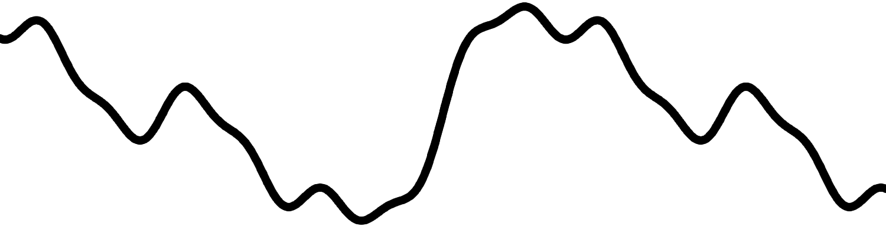

layout: true

background-image: url(resources/camo-8000px-transparent.png)
background-size: 2000px, 2000px

---

background-color: #111111
class: center, middle, white-text

# Procedural Generation in C++ vs. Photoshop:
## Learn, Benchmark, and Prove Nothing

06/12/2018

Meven 'mevouc' Courouble

???

# Learn
## The project: ErratiCamo
### Purpose: use Perlin noise to produce camo texture
### Perlin noise
### Treshold & layers
### Color & tresholds tweaking

# Benchmark
## Time spent
### Prepare & setup
### Code / script
## Run time
## Ease to improve & customize

# Prove nothing = Conclusion
## Use tools made for what you want to do

## Github link

---

# Idea

### What I wanted

- Learn Ruby

- Play with a new image processing library

- Do a side-project with procedural generation

--

### What I actually did

- C++ project with OpenCV library (for the second time)

- Learned procedural generation

- Lost my time

- Did another version using Photoshop

---

background-color: #111111
class: center, middle, white-text

# Learn

---

background-color: #111111
class: center, middle, white-text

# ErratiCamo

---

# The project

- Generate multi-layers camo textures

- Made in C++ with OpenCV

- [github.com/mevouc/erraticamo](https://github.com/mevouc/erraticamo)

### Steps: 
- Perlin noise

- Binarization

- Colorization

- Layering

---

background-image: url(resources/camo-4000px.png)
background-size: 2000px, 2000px

---

# Perlin noise

- Gradient noise

- Developed by Ken Perlin in 1983 (published in 1985)

- Used in texture, world-maps, clouds generation

---

class: center, middle

Uniform random

---

class: center, middle

1D Perlin noise

---

class: center, middle

2D Perlin noise

---

class: center, middle

2D Perlin noise

---

class: center, middle

2D Perlin noise binarized

---

class: center, middle

Colorization & layering

---

# Photoshop version

- Script of Photoshop actions

- Can be run on any empty document

- TODO PHOTOSHOP SCRIPT SCREENSHOT

---

# Tweaking

- Change tresholds so layers do not cover the same surface

- Change colors to have camo-like look

---

background-color: #111111
class: center, middle, white-text

# Benchmark

---

### Implementation time

C++                      | Time spent | Photoshop    | Time spent
------------------------ | ---------- | -----------  | ----------
**Documentation**        | 2 h        | **Script**   | 1 h 30 min
**Perlin noise PoC**     | 3 h        | **Tweaking** | 1 h
**Coding the project**   | 5 h        |              |
                         |            |              |
**Total**                | 12 h       | **Total**    | 2 h 30 min

.left-column[

### Compile time

C++    | Photoshop
------ | ---------
16,6 s | 0

]

.right-column[

### Run time

C++   | Photoshop
----- | ---------
3,3 s | TODO

]

---

background-color: #111111
class: center, middle, white-text

# Questions?

---

background-color: #111111
class: center, middle, white-text

Platine
